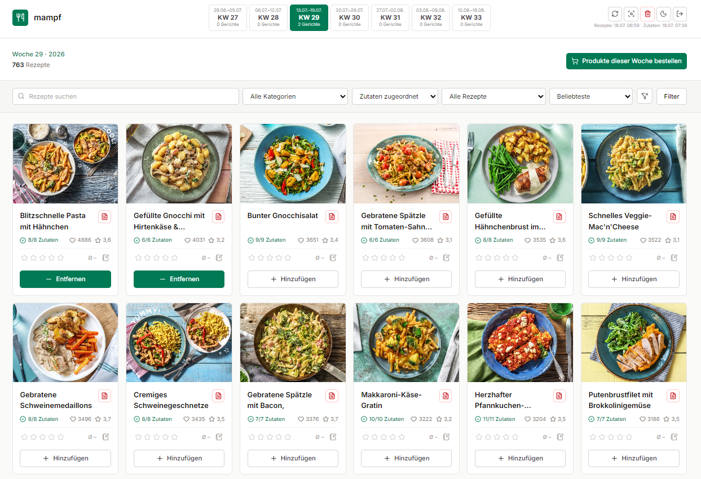

# 🥗 mampf 🥗

recipe planning with hellofresh import, rewe ingredient matching and weekly basket creation.



## installation

```bash
mkdir mampf
cd mampf
git clone https://github.com/vielhuber/mampf.git .
composer install
npm install
npm run prod
cp .env.example .env
sed -i "s/replace-with-a-long-random-value/$(php -r 'echo bin2hex(random_bytes(32));')/" .env
mkdir -p .bin
curl -fsSL https://github.com/lexiforest/curl-impersonate/releases/download/v1.5.6/curl-impersonate-v1.5.6.x86_64-linux-gnu.tar.gz | tar -xz -C .bin curl-impersonate
chmod +x .bin/curl-impersonate
php _public/auth/index.php create "mail@example.org" "password"
```

point a virtual host document root to `_public`. sign into rewe and export the cookies with cookie-editor as json:

- [https://www.rewe.de/shop](https://www.rewe.de/shop) to `.data/cookies/rewe-shop.json`
- [https://account.rewe.de/realms/sso/account](https://account.rewe.de/realms/sso/account) to `.data/cookies/rewe-account.json`
